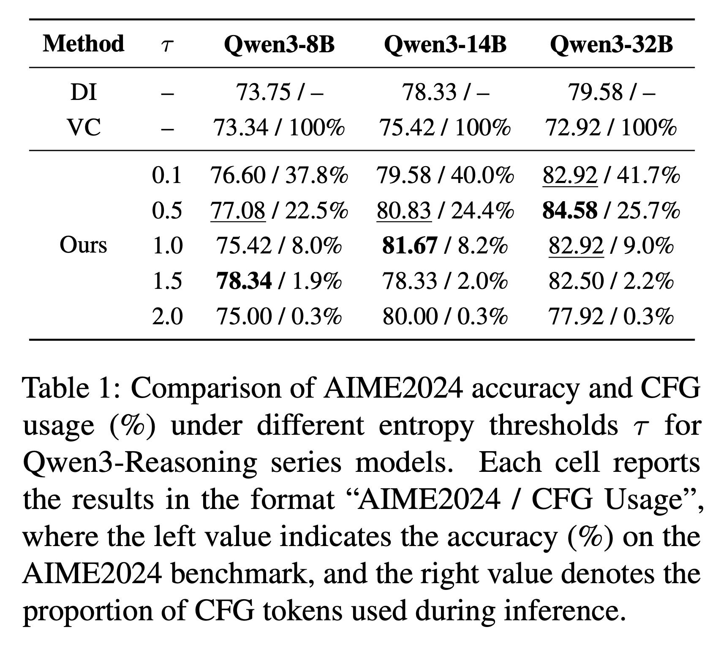
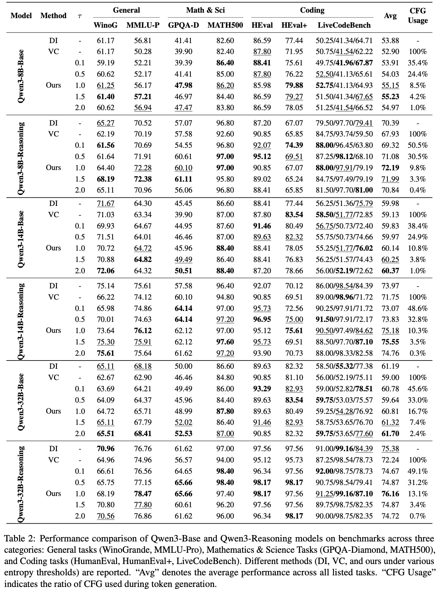

<!-- # magic-edit.github.io -->

<p align="center">

  <h2 align="center">Less is More: Improving LLM Reasoning with Minimal Test-Time Intervention</h2>
  <p align="center">
    <a href="https://zhenyangcs.github.io/"><strong>Zhen Yang</strong></a><sup>1</sup>
    ·
    <a href="https://scholar.google.com/citations?user=8H1FvGcAAAAJ&hl=zh-CN"><strong>Mingyang Zhang</strong></a><sup>5</sup>
    ·  
    <a href="https://github.com/Chenfeng1271"><strong>Feng Chen</strong></a><sup>3</sup>
    ·
    <a href="https://dingangui.github.io/"><strong>Ganggui Ding</strong></a><sup>4</sup>
    <br>
    <a href="https://liang-hou.github.io/"><strong>Liang Hou</strong></a><sup>2</sup>
    ·
    <a href="https://www.xtao.website/"><strong>Xin Tao</strong></a><sup>2</sup>
    ·
    <a href="https://scholar.google.com/citations?user=P6MraaYAAAAJ&hl=en"><strong>Pengfei Wan</strong></a><sup>2</sup>
    ·
    <a href="https://www.yingcong.me/"><strong>Ying-Cong Chen</strong></a><sup>1,6</sup>
    <br>
    <sup>1</sup>HKUST(GZ) · <sup>2</sup>Kuaishou Technology · <sup>3</sup>AIML · <sup>4</sup>ZJU · <sup>5</sup>Ant Group · <sup>6</sup>HKUST
    <br>
    </br>
        <!-- <a href="https://arxiv.org/abs/2310.12149"> -->
        <a href="https://arxiv.org/abs/2510.13940">
        </a>
        <!-- <a href="https://aim-uofa.github.io/OIR-Diffusion/">
        </a>
        <a href="https://drive.google.com/file/d/1JX8w0S9PCD9Ipmo9IiICO8R7e1haTGdF/view?usp=sharing">
        </a>
        <a href="https://iclr.cc/virtual/2024/poster/18242">
        </a> -->
  </p>
</p>


<!-- <p align="center"><b>We will release the code soon!</b></p> -->


## Getting Started
1. Create the environment and install the dependencies by running:
```
conda create -n MTI python=3.10
conda activate MTI
pip install vllm==0.10.2
pip install accelerate==1.10.1
pip install transformers==4.56.1
```
2. Run offline with vllm
```
python run_vllm_offline.py
```

3. Run online with vllm
```
python run_vllm_online.py \
  --model Qwen3/Qwen3-8B \
  --tokenizer Qwen3/Qwen3-8B \
  --host 0.0.0.0 \
  --port 6666 \
  --api-key yzisallyouneed
```

4. Run with huggingface
```
python run_hf.py
```
The huggingface version is only for learning purposes because it does not provide inference acceleration. It is recommended to use the vllm version for evaluation.

## Evaluation
Since the monkey patch may introduce unknown bugs, we recommend that, during the evaluation phase, you directly replace `vllm`’s `GPUModelRunner.execute_model` and `FlashAttentionImpl.forward` in the Conda-created virtual environment with our `execute_model` and `forward` implementations.

## TODO
1. SGLang version
2. More models
3. Code combine opencompass
4. MTI on VLM / VLA / dllm


## Method


<p align="center">
  <table align="center">
    <td>
      </img>
    </td>
  </table>
</p>


### Main results

<p align="center">
  <table align="center">
    <td>
      </img>
    </td>
  </table>
</p>

<p align="center">
  <table align="center">
    <td>
      </img>
    </td>
  </table>
</p>


## Acknowlegment
Many thanks for the generous help from [Lequan Lin](https://scholar.google.com/citations?user=UR3NoxIAAAAJ&hl=en&google_abuse=GOOGLE_ABUSE_EXEMPTION%3DID%3D7ff5914ede42912b:TM%3D1760170127:C%3Dr:IP%3D61.16.102.76-:S%3DK0KpwoZF8myjNDV5eeLcduk%3B+path%3D/%3B+domain%3Dgoogle.com%3B+expires%3DSat,+11-Oct-2025+11:08:47+GMT).


## BibTeX
```BibTeX
@article{yang2025less,
  title={Less is More: Improving LLM Reasoning with Minimal Test-Time Intervention},
  author={Yang, Zhen and Zhang, Mingyang and Chen, Feng and Ding, Ganggui and Hou, Liang and Tao, Xin and Wan, Pengfei and Chen, Ying-Cong},
  journal={arXiv preprint arXiv:2510.13940},
  year={2025}
}
```
